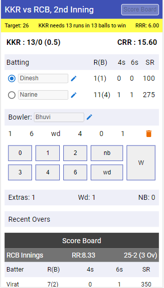
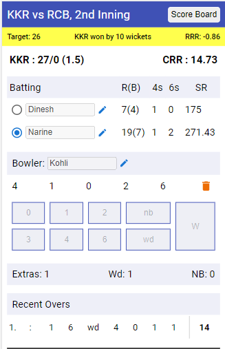
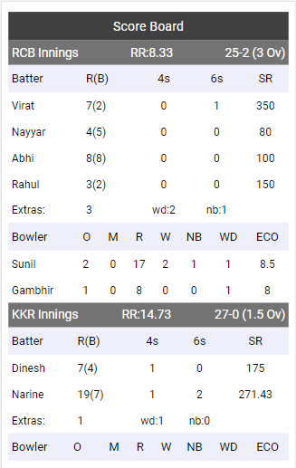

## What is this?

A gully cricket score board used to maintain the score of the team and individual players with runs, balls & strike rate including bowler's total over, maiden, runs given, economy, etc. This project was build using React JS

## Screenshot

   

## Recommendation

This application is best viewed in Mobile/Phone browser.

## Problem

Currently data has been managed using state. Hence don't refresh the page until the completion of match otherwise all data will be gone. For that you can use android application which you can **download** from the **Release Section**.

## Live Demo?

This application is live and deployed in Netlify. You can check here [gully-cricket-score-board](https://gully-cricket.netlify.app/).

## Available Scripts

In the project directory, you can run:

### `npm start`

Runs the app in the development mode. Open [http://localhost:3000](http://localhost:3000) to view it in the browser.

The page will reload if you make edits. You will also see any lint errors in the console.
